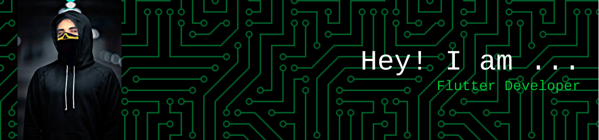

# 💫 About Me:
“Welcome to the dazzling GitHub profile of Furqan Uddin, a Flutter developer with a flair for crafting mesmerizing and top-of-the-line mobile applications. With a keen interest in software development and a devotion to elegant code, I aim to deliver amazing user experiences through my projects. This GitHub repository is a splendid display of my work and my involvement in the dynamic Flutter community. I am always eager to learn new skills and improve my knowledge of Dart and Flutter.”

## 🌐 Socials:
 <a style="display: inline-block; background-color: #0077B5; color: #fff; text-decoration: none; padding: 10px 20px; border-radius: 5px; font-family: Arial, sans-serif; font-size: 14px;" href="https://www.linkedin.com/in/ffurqanuddin/">LinkedIn</a>     

# 💻 Tech Stack:
             	  
# 📊 GitHub Stats:
 
 

## 🏆 GitHub Trophies

## 🐦 Latest Tweet

### ✍️ Random Dev Quote

### 🔝 Top Contributed Repo

### 😂 Random Dev Meme

---

<!-- Proudly created with GPRM ( https://gprm.itsvg.in ) -->
